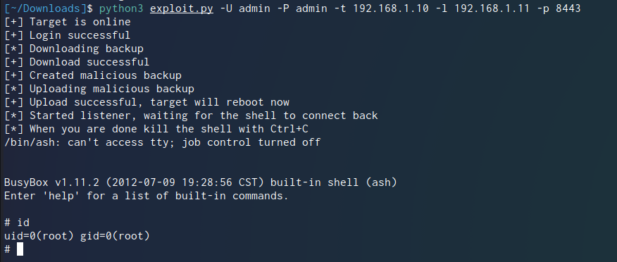

# CVE-2022-40799

Title: D-Link DNR-322L - Authenticated Remote Code Execution  
CVE: [CVE-2022-40799](https://cve.mitre.org/cgi-bin/cvename.cgi?name=CVE-2022-40799)  
Advisory: https://supportannouncement.us.dlink.com/announcement/publication.aspx?name=SAP10305  
Affected: <= 2.60B15  
Blogpost: https://blog.mkiesel.ch/posts/dlink_dnr322/



# Vulnerability
Inside the configuration backup from "Maintenance/System/Configuration Settings" is the bash script "rc.init.sh". The device does not check the integrity of a restored configuration backup which enables editing of set bash script. This bash script will be executed when the device boots. 

# Usage
```
usage: exploit.py [-h] -U USERNAME [-P PASSWORD] -t TARGET -l LHOST -p LPORT

options:
  -h, --help            show this help message and exit
  -U USERNAME, --username USERNAME
                        Username, ex: admin
  -P PASSWORD, --password PASSWORD
                        Password for the specified user
  -t TARGET, --target TARGET
                        IP of the target, ex: 192.168.99.99
  -l LHOST, --lhost LHOST
                        IP for the reverse shell to connect back to, ex: 123.123.123.123
  -p LPORT, --lport LPORT
                        Port for the reverse shell to connect back to, ex: 8443
```

# Known Bugs
If the device is sleeping, the download of the backup works but the upload creates a connection error. Just execute the exploit twice. 

# Legal
This code is provided for educational use only. If you engage in any illegal activity the author does not take any responsibility for it. By using this code, you agree with these terms.
